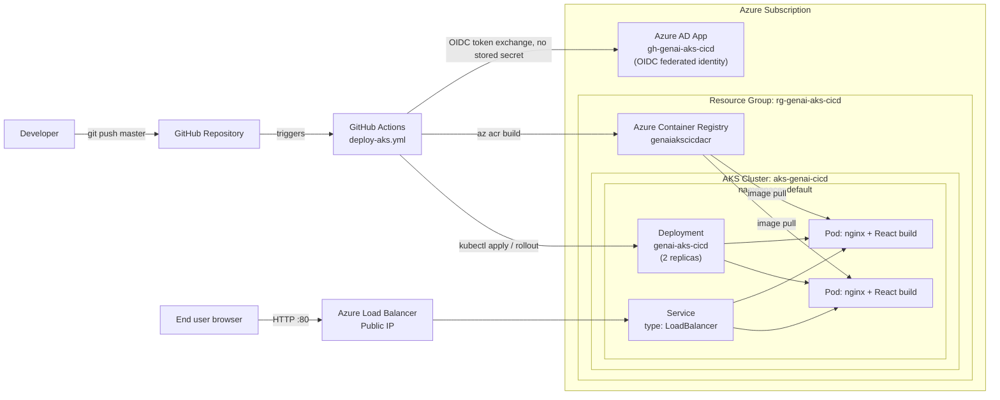
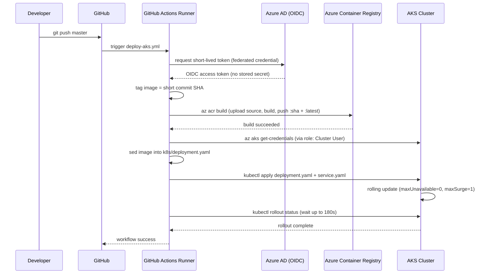

# GenAI AKS CI/CD — Project Walkthrough

End-to-end reference for this repo: what it is, how it's built, how it deploys, and how
to operate it day to day. All diagrams are Mermaid and render natively on GitHub.

---

## 1. What this is

A React 19 + TypeScript + Vite single-page app, containerized with nginx, deployed to
Azure Kubernetes Service (AKS) via a GitHub Actions pipeline that builds the image in
Azure Container Registry (ACR) and rolls it out to the cluster on every push to `master`.

| Layer | Technology |
|---|---|
| App | React 19, TypeScript, Vite 8 |
| Container | Docker multi-stage build → nginx:1.27-alpine |
| Registry | Azure Container Registry (`genaiakscicdacr`) |
| Orchestration | Azure Kubernetes Service (`aks-genai-cicd`) |
| CI/CD | GitHub Actions, OIDC federated auth (no stored cloud secrets) |
| Source control | GitHub (`tanmaymishra0607/GenAI_AKS_CICD`) |

---

## 2. Repository layout

```
GenAI_AKS_CICD/
├── src/                          # React application source
│   ├── App.tsx, App.css
│   ├── main.tsx, index.css
│   └── assets/
├── public/                       # Static assets copied as-is
├── index.html                    # Vite entry HTML
├── package.json / package-lock.json
├── tsconfig*.json                # TypeScript project config
├── vite.config.ts                # Vite build config
├── .oxlintrc.json                # Linter config
│
├── Dockerfile                    # Multi-stage build: Node build → nginx runtime
├── nginx.conf                    # SPA routing + /healthz endpoint
├── .dockerignore
│
├── k8s/
│   ├── deployment.yaml           # Deployment: 2 replicas, probes, resource limits
│   └── service.yaml              # LoadBalancer Service, port 80
│
├── .github/workflows/
│   └── deploy-aks.yml            # Build → push to ACR → deploy to AKS
│
└── docs/
    ├── AKS_DEPLOYMENT.md         # Azure/OIDC setup commands (reference)
    └── WALKTHROUGH.md            # This document
```

---

## 3. Architecture



---

## 4. CI/CD pipeline flow

Triggered by `push` to `master` or manually via `workflow_dispatch`.



**Workflow steps** (`.github/workflows/deploy-aks.yml`):

1. **Checkout** — pulls the repo.
2. **Azure login (OIDC)** — exchanges a GitHub-issued token for a short-lived Azure
   token via the federated identity; no client secret is stored anywhere.
3. **Set image tag** — uses the first 12 chars of the commit SHA as the image tag.
4. **Build and push image to ACR** — `az acr build` builds the Dockerfile *inside ACR*
   (no local Docker daemon needed on the runner) and pushes `:<sha>` and `:latest`.
5. **Set AKS context** — fetches cluster credentials via `azure/aks-set-context`.
6. **Render manifests** — substitutes the real image reference into
   `k8s/deployment.yaml` in place of `IMAGE_PLACEHOLDER`.
7. **Deploy to AKS** — `kubectl apply` on both manifests, then blocks on
   `kubectl rollout status` until the new pods are healthy or it times out.

---

## 5. Infrastructure inventory

Provisioned in Azure subscription `Azure subscription 1` (East US):

| Resource | Name | Notes |
|---|---|---|
| Resource Group | `rg-genai-aks-cicd` | Contains everything below |
| Container Registry | `genaiakscicdacr` | Basic SKU, login server `genaiakscicdacr.azurecr.io` |
| AKS Cluster | `aks-genai-cicd` | 1 node pool, `Standard_D2s_v3`, managed identity enabled |
| Azure AD App | `gh-genai-aks-cicd` | OIDC federated identity for GitHub Actions |

**Kubernetes objects** (namespace `default`):

| Object | Name | Spec |
|---|---|---|
| Deployment | `genai-aks-cicd` | 2 replicas, readiness/liveness probes on `/healthz`, requests 50m/64Mi, limits 250m/128Mi |
| Service | `genai-aks-cicd` | `type: LoadBalancer`, port 80 → pod port 80 |

**IAM (RBAC) on the GitHub Actions identity**:

| Scope | Role | Why |
|---|---|---|
| ACR `genaiakscicdacr` | `Contributor` | `az acr build` needs control-plane actions (resolve registry via ARM, request a build-context upload SAS URL) beyond what `AcrPush`/`Reader` grant |
| Resource Group `rg-genai-aks-cicd` | `Azure Kubernetes Service Cluster User Role` | Lets `az aks get-credentials` fetch a working kubeconfig |

---

## 6. Step-by-step: how this was built

### 6.1 Source control
```bash
git init
git add -A
git commit -m "Initial commit"
gh repo create GenAI_AKS_CICD --public --source=. --remote=origin --push
```

### 6.2 Containerize the app
- `Dockerfile`: stage 1 runs `npm ci && npm run build` on `node:22-alpine`; stage 2
  copies `dist/` into `nginx:1.27-alpine` alongside a custom `nginx.conf` that serves
  the SPA (`try_files ... /index.html`) and exposes `/healthz`.
- Verified locally: `docker build`, `docker run`, `curl` both `/` and `/healthz`.

### 6.3 Kubernetes manifests
- `k8s/deployment.yaml` — image field left as `IMAGE_PLACEHOLDER`, substituted by CI
  at deploy time. Rolling update configured for zero downtime (`maxUnavailable: 0`).
- `k8s/service.yaml` — `LoadBalancer` type for a public IP with no extra ingress setup.

### 6.4 Provision Azure infrastructure
```bash
az group create --name rg-genai-aks-cicd --location eastus
az provider register --namespace Microsoft.ContainerRegistry --wait
az provider register --namespace Microsoft.ContainerService --wait
az acr create --resource-group rg-genai-aks-cicd --name genaiakscicdacr --sku Basic
az aks create --resource-group rg-genai-aks-cicd --name aks-genai-cicd \
  --node-count 1 --node-vm-size Standard_D2s_v3 \
  --generate-ssh-keys --attach-acr genaiakscicdacr --enable-managed-identity
```
> The subscription's quota didn't allow `Standard_B2s`(cheapest burstable size) in
> `eastus` — `Standard_D2s_v3` was used instead. Check allowed sizes for a new/trial
> subscription before picking a VM size: the `BadRequest` error from `az aks create`
> lists exactly what's available.

### 6.5 Set up OIDC (no stored cloud secrets)
```bash
APP_ID=$(az ad app create --display-name "gh-genai-aks-cicd" --query appId -o tsv)
az ad sp create --id "$APP_ID"

az ad app federated-credential create --id "$APP_ID" --parameters '{
  "name": "github-main",
  "issuer": "https://token.actions.githubusercontent.com",
  "subject": "repo:OWNER@OWNER_ID/REPO@REPO_ID:ref:refs/heads/master",
  "audiences": ["api://AzureADTokenExchange"]
}'
```
> **Gotcha**: GitHub's OIDC subject claim is not simply `repo:owner/repo:ref:...` — it
> includes stable numeric owner/repo IDs (`owner@ownerID/repo@repoID`). Get the exact
> string from a failed run's "Azure login" step log (it prints `subject claim - ...`)
> rather than guessing it.

```bash
az role assignment create --assignee-object-id <SP_OBJECT_ID> \
  --assignee-principal-type ServicePrincipal --role Contributor \
  --scope /subscriptions/<SUB_ID>/resourceGroups/rg-genai-aks-cicd/providers/Microsoft.ContainerRegistry/registries/genaiakscicdacr

az role assignment create --assignee-object-id <SP_OBJECT_ID> \
  --assignee-principal-type ServicePrincipal --role "Azure Kubernetes Service Cluster User Role" \
  --scope /subscriptions/<SUB_ID>/resourceGroups/rg-genai-aks-cicd
```
> **Gotcha (Windows/Git Bash only)**: any `az` argument starting with `/subscriptions/...`
> gets mangled by MSYS path conversion into something like `C:/Program Files/Git/subscriptions/...`,
> producing a confusing `MissingSubscription` error. Fix: `export MSYS_NO_PATHCONV=1`
> before running `az` commands with resource-ID scopes.

### 6.6 Wire up GitHub
```bash
gh secret set AZURE_CLIENT_ID --body "$APP_ID"
gh secret set AZURE_TENANT_ID --body "$(az account show --query tenantId -o tsv)"
gh secret set AZURE_SUBSCRIPTION_ID --body "$(az account show --query id -o tsv)"

gh variable set ACR_NAME --body "genaiakscicdacr"
gh variable set AKS_CLUSTER_NAME --body "aks-genai-cicd"
gh variable set AKS_RESOURCE_GROUP --body "rg-genai-aks-cicd"
```

### 6.7 Deploy
```bash
git push origin master        # auto-triggers the workflow
# or
gh workflow run deploy-aks.yml
gh run watch --exit-status
```

---

## 7. Operational runbook

### Deploy a change
```bash
git add -A && git commit -m "..." && git push
```
That's it — the pipeline builds, pushes, and rolls out automatically. Watch it with:
```bash
gh run watch --exit-status
```

### Check what's running
```bash
kubectl get pods -n default -l app=genai-aks-cicd
kubectl get svc genai-aks-cicd -n default      # EXTERNAL-IP is the public URL
kubectl rollout status deployment/genai-aks-cicd -n default
```

### View logs
```bash
kubectl logs -n default -l app=genai-aks-cicd --tail=100 -f
```

### Roll back
```bash
kubectl rollout undo deployment/genai-aks-cicd -n default
# or to a specific revision:
kubectl rollout history deployment/genai-aks-cicd -n default
kubectl rollout undo deployment/genai-aks-cicd -n default --to-revision=<N>
```

### Scale
```bash
kubectl scale deployment/genai-aks-cicd -n default --replicas=3
```
(Note: the next CI deploy re-applies `k8s/deployment.yaml`, which pins `replicas: 2` —
update that file if you want the new count to persist.)

### Run it locally without Kubernetes
```bash
npm install && npm run dev          # dev server with HMR
# or
docker build -t genai-aks-cicd . && docker run -p 8080:80 genai-aks-cicd
```

---

## 8. Known trade-offs / next steps

- **Single environment, no staging.** Every push to `master` goes straight to the one
  AKS namespace. Adding a staging environment would mean a second namespace (or
  cluster) and a GitHub Environment with required reviewers gating the production job.
- **No ingress/TLS.** The Service is a bare `LoadBalancer` on port 80 (HTTP only, IP
  address rather than a domain). Adding an ingress controller + cert-manager would be
  the next step for a real production domain with HTTPS.
- **No automatic rollback on failed rollout.** `kubectl rollout status` fails the CI job
  after 180s, but doesn't run `kubectl rollout undo` — the previous ReplicaSet stays up
  serving traffic (safe), but the bad revision isn't cleaned up automatically.
- **Single-node cluster.** Fine for a demo; not resilient to node failure. Bump
  `--node-count` for real availability.
